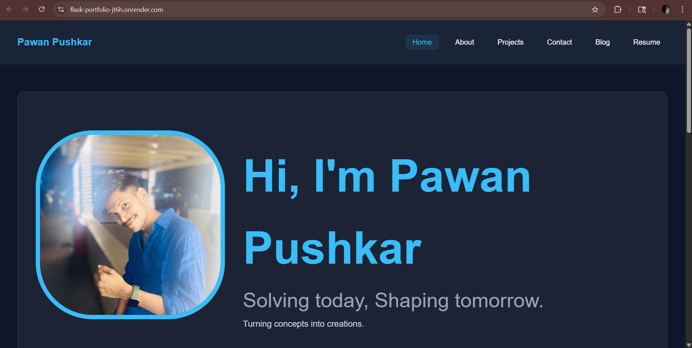
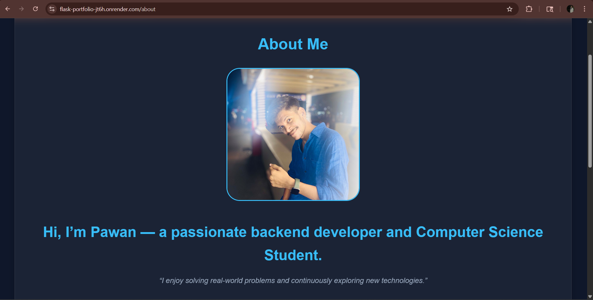

# 🌐 Flask Portfolio Website

This is my personal portfolio website built using **Flask (Python)** and deployed online.

🔗 **Live Website:**
https://flask-portfolio-jt6h.onrender.com

---

## 🚀 Features

* 🏠 Home Page with introduction
* 👤 About Me section
* 💼 Projects showcase
* 📬 Contact form (stores messages in database)
* 📝 Blog section
* 📄 Resume page
* 🔐 Admin panel to view messages

---

## 🛠️ Tech Stack

* **Backend:** Flask (Python)
* **Frontend:** HTML, CSS
* **Database:** SQLite
* **Deployment:** Render

---

## 📂 Project Structure

```
flask-portfolio/
│── app.py
│── requirements.txt
│── static/
│── templates/
│── .gitignore
```

---

## ▶️ How to Run Locally

1. Clone the repository:

```
git clone https://github.com/pawanpushkar/flask-portfolio.git
cd flask-portfolio
```

2. Install dependencies:

```
pip install -r requirements.txt
```

3. Run the app:

```
python app.py
```

4. Open in browser:

```
http://127.0.0.1:5000/
```

---

## 🌍 Deployment

This project is deployed using **Render**.

---

## 📸 Preview




---

## 👨‍💻 Author

**Pawan Pushkar**

* GitHub: https://github.com/pawanpushkar


